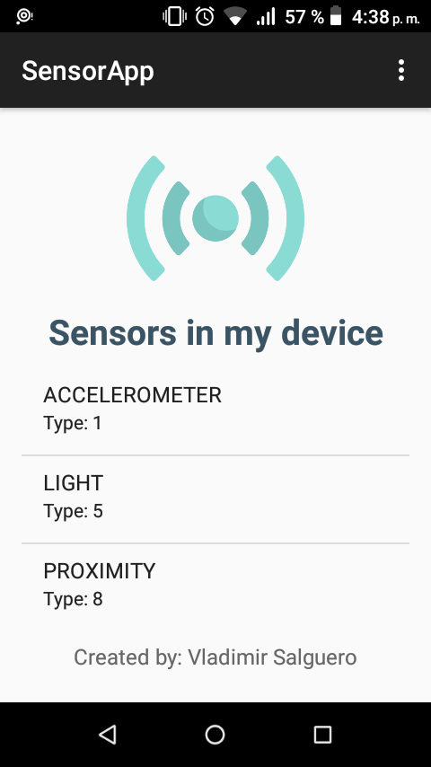

# SensorApp

Aplication Android Native with Java example using List the Sensors available in the device.

You can open the sample using Android Studio IDE 4

  

  
<strong>Preview</strong> 

  

 
<strong>SUPPORT</strong>
  

